# Smart-Glove
Sign Language recognition system (model) developed using Random Forest Classifier, that translates the sign language alphabets and common words into text and sound.
________________________________
## Hardware look
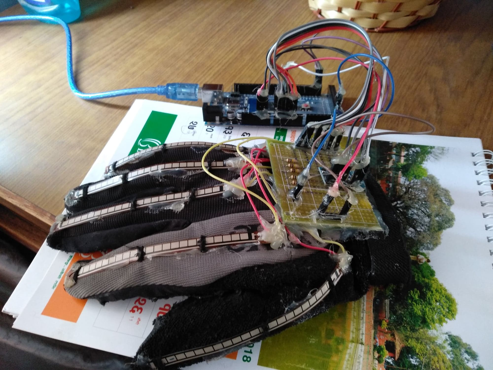
________________________________
### Overall system Information
* __[Supervised machine learning](https://en.wikipedia.org/wiki/Supervised_learning).__

* [Random Forest Algorithm](https://en.wikipedia.org/wiki/Random_forest)

* System recognizes gestures through the use of [flex sensor](https://en.wikipedia.org/wiki/Flex_sensor),
 [accelerometer](https://www.sciencedirect.com/topics/engineering/accelerometer-sensor) 
 and [gyroscope](https://www.elprocus.com/gyroscope-sensor/).

* All the programming and integration has been done in mac and for mac, so  adjust the port for arduino as per device port number.

* Arduino_code.ino is burned inside the [Arduino Mega2560](https://www.arduino.cc/en/Guide/ArduinoMega2560).

* python_code whenever is executed it fetches the data from the serial port of the laptop then passes the data from the model for prediction of output as well as display and audio.

_Note : Dataset is developed for the used system, so is not made public._
____________________________________
### Data Visualizations of overall sensor data
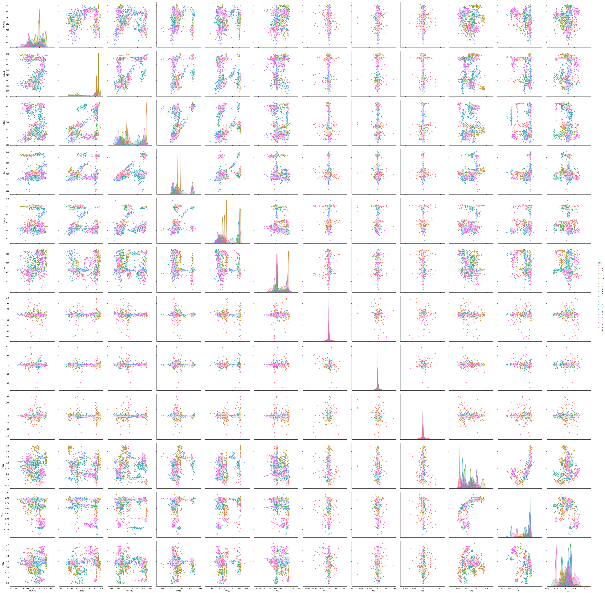
____________________________________
#### Some [correlation](https://www.surveysystem.com/correlation.htm) plots of different sensors values for different alphabets
* Correlation plot of alphabet __A__

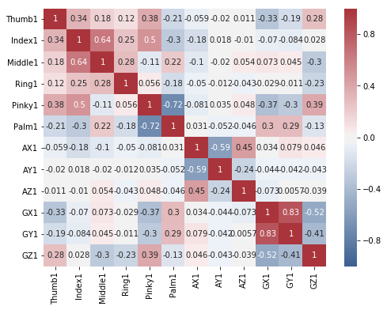
_______________________________________
* Correlation plot of alphabet __B__ 

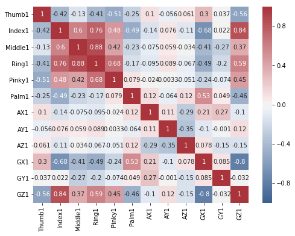
_______________________________________
* Correlation plot of alphabet __C__ 

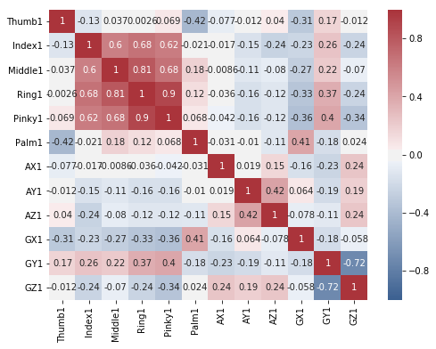
_______________________________________
* Correlation plot of alphabet __D__

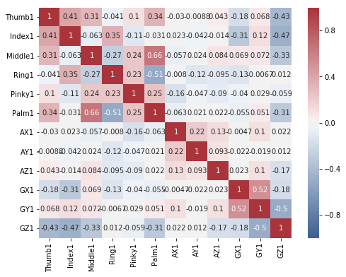
_______________________________________
* Correlation plot of alphabet __E__

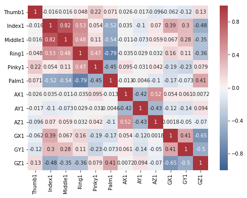
_______________________________________
* Correlation plot of alphabet __M__ 

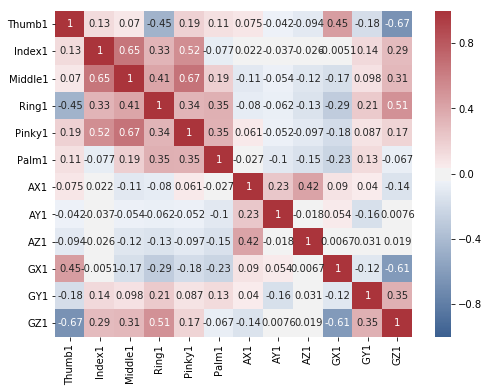
_______________________________________
* Correlation plot of alphabet __N__ 

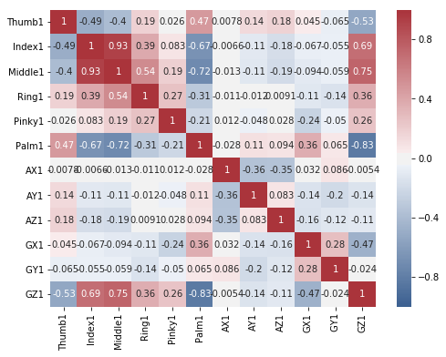
_______________________________________
* Correlation plot of alphabet __O__ 

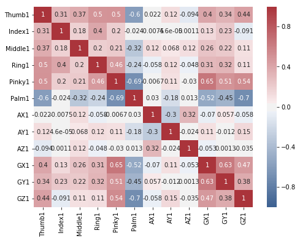
_______________________________________
* Correlation plot of alphabet __S__

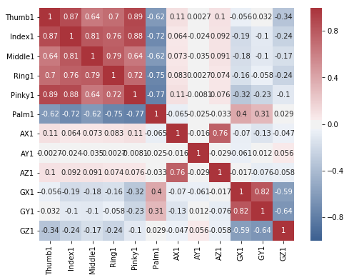
_______________________________________
* Correlation plot of alphabet __T__

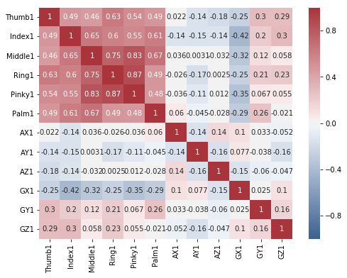
_______________________________________
* Correlation plot of alphabet __U__

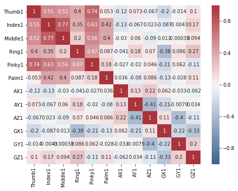
_______________________________________
* Correlation plot of alphabet __V__

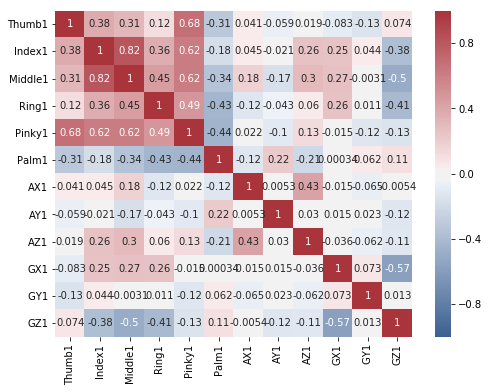

_______________________________________

## Authors
* __[Adarsh Ghimire](ghimireadarsh.github.io)__ - _Initial Work_ - Project Lead
* __[Aakriti Basnet](https://www.linkedin.com/in/aakritibasnet/)__ - Project Member 
* __[Anushma Shrestha](https://np.linkedin.com/in/anushma-shrestha-862449125)__- Project Member
* __[Bhupendra Kadayat](https://www.linkedin.com/in/bhupendra-kadayat-48b6b3178/)__ - Project Member
