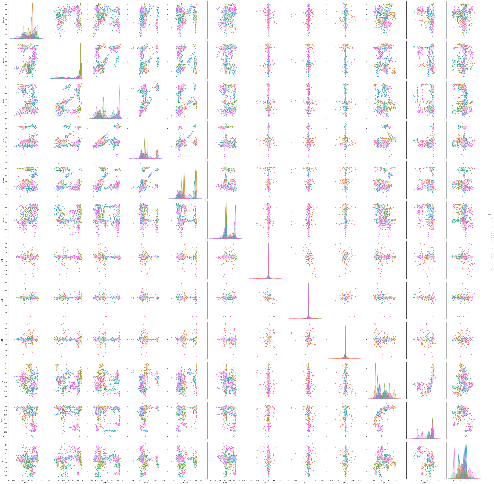

# Smart-Glove
Sign Language recognition system (model) developed using Random Forest Classifier, that translates the sign language alphabets and common words into text and sound.

* Supervised machine learning.

* System recognizes gestures through the use of flex sensor, accelerometer and the gyroscope.

* Coding is done in mac, so  adjust the port as per device port number.

* arduino_code.ino is burned inside the Arduino Mega2560.

* python_code whenever is executed it fetches the data from the serial port of the laptop then passes the data from the model for prediction of output as well as display and audio.

* Dataset is developed for the used system, so is not made public.

# Data Visualizations

## Correlation plots
* correlation plot of alphabet a 
* correlation plot of alphabet b 
* correlation plot of alphabet c 
* correlation plot of alphabet d 
* correlation plot of alphabet e 
* correlation plot of alphabet m 
* correlation plot of alphabet n 
* correlation plot of alphabet o 
* correlation plot of s 
* correlation plot of alphabet t 
* correlation plot of alphabet u 
* correlation plot of alphabet v 
